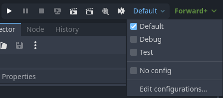
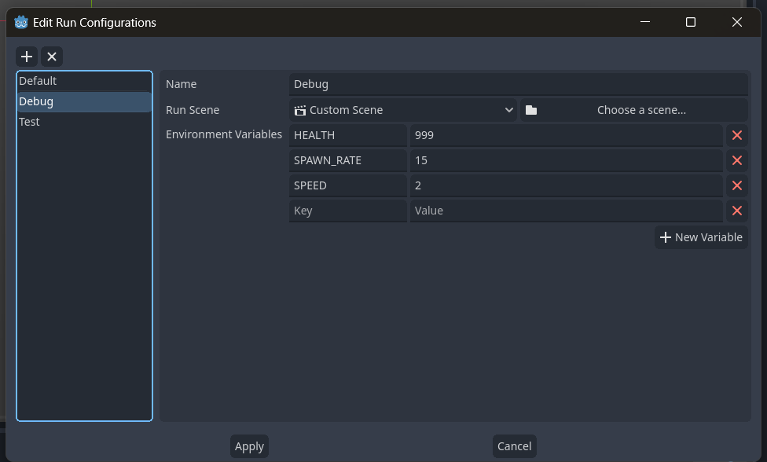

# Godot Run Configurations

A Godot plugin that adds Run Configurations to the editor. Configurations can be used to create templates for environment variables and entry scenes that can be easily accessed and run from the editor.

## Installation

1. Download the addon from the Asset Library.
2. Activate the addon.
3. Go to `Project Settings -> Autoloads` and re-order `RunConfigManager` to the top. While this is optional, the autoload is what sets the environment variables. If any of your autoloads uses environment variables in their `_init()` function, you should do this to ensure the environment variables are properly set.

## Usage

This plugin adds two buttons to the title bar: a custom play button and a configuration button.

Here, you can quickly select a config that will come into effect when playing a scene.

Click on "Edit configurations..." to add or modify configs.

Each config contains the following settings:

| Config                | Description                                  | Note                                                                                                                                                  |
| --------------------- | -------------------------------------------- | ----------------------------------------------------------------------------------------------------------------------------------------------------- |
| Name                  | Name of the config                           |
| Run Scene             | Which scene to run when the config is active | For this to come into effect, you have to run from the custom run button. Using the regular play buttons will use the respective scene of said button |
| Environment Variables | OS environment variables                     | You can get these variables using `OS.get_environment(key)`                                                                                           |
